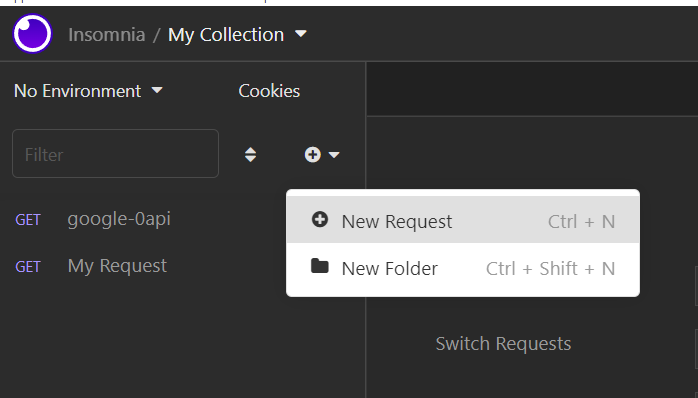
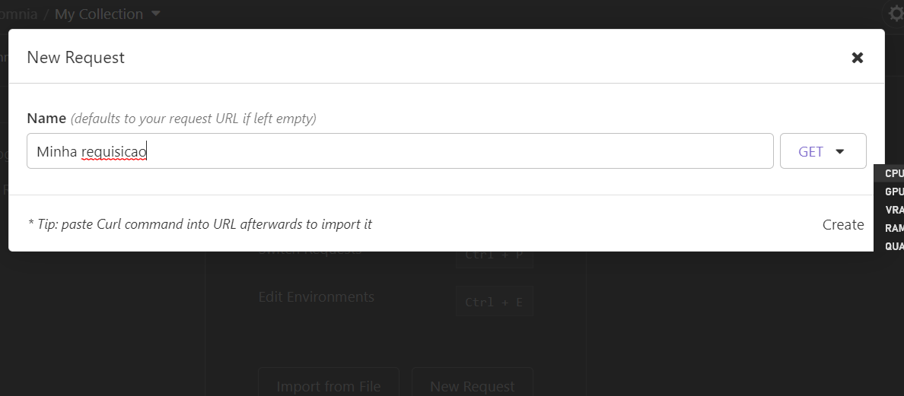
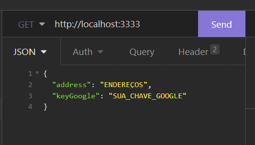

<div align="center" style="background-color: #25292d"> 
    
</div>


## Desafio Tech Backend

### 📦 Visão Geral
---

A ideia do desafio é simples, entender como você pensa na hora de abordar os
problemas. Nas linguagens e tecnologias que se sentir mais confortável.

### 🏆 Sobre o desafio
---

Criar uma API Rest que:

1. Receba dois ou mais endereços `(ex: Av. Rio Branco, 1 Centro, Rio de Janeiro RJ, 20090003; Praça Mal. Âncora, 122 Centro, Rio de Janeiro RJ, 20021200; Rua 19 de Fevereiro, 34 Botafogo, Rio de Janeiro RJ, 22280030)` como parâmetros de entrada

2. Resolva a geolocalização entre os endereços utilizando a API do Google

>https://developers.google.com/maps/documentation/geocoding/start

3.  Após isso, com a latitude e longitude em mãos dos endereços, implementar o algoritmo de cálculo de distância Euclidiana e aplicar em todas as combinações de endereços.

4. Retorne as distâncias calculadas entre os todos os endereços e indique os endereços mais próximos e também os endereços mais distantes.

### :heavy_check_mark: Resolução dos Desafios

Para a conclusão dos desafios propostos eu optei por usar as seguintes tecnologias:

Tecnologias||
----------|----
NodeJS|
Typescript||
Express||
          
### ⚙ Como rodar o projeto

Após clonar o projeto, dependendo do seu gerenciador de pacotes, você pode digitar algum desses comandos no seu terminal para o baixar os pacotes necessários, isso vai criar automaticamente a página `node_modules`.

```bash
npm i
# ou
yarn
```

Logo depois de baixar as dependencias necessárias, ainda no terminal, digite um desses comandos(mais uma vez, com base no seu gerenciador de pacotes).

```bash
npm run dev
# ou
yarn dev
```

Esse comando vai iniciar a aplicação no seu localhost, para acessar basta abrir em qualquer navegador nesse endereço: 
 [http://localhost:3333](http://localhost:3333). 

Para obter um resultado mais prático e visível eu indigo o download de algum software de requisições REST como o [Insomnia](https://insomnia.rest/download) ou [Postman](https://www.postman.com/downloads/).

Crie uma nova requisição do tipo `GET`:





Agora coloque o endereço do localhost juntamente com a porta no campo de pesquisa do software. No escopo da requisição escolha a opção JSON e crie um corpo no seguinte formato:

```Json
    {
	    "address": "ENDEREÇOS",
	    "keyGoogle": "SUA_CHAVE_GOOGLE"
    }
```

Não se esqueça de preencher com os endereços desejados e sua chave da API do Google, onde você pode saber mais [aqui](https://developers.google.com/maps/documentation/geocoding/get-api-key).



Se tudo estiver correto a requisição retornará um objeto JSON com esse formato:

```Json
{
	"allComparation": [
		{
			"firstAddress": "Av. Rio Branco, 1 - Centro, Rio de Janeiro - RJ, 20090-003, Brazil",
			"secondAddress": "R. Dezenove de Fevereiro, 34 - Botafogo, Rio de Janeiro - RJ, 22280-030, Brazil",
			"distance": 0.05384422824788258
		},
		{
			"firstAddress": "R. Uruguaiana, 22 - Centro, Rio de Janeiro - RJ, 20050-090, Brazil",
			"secondAddress": "R. Dezenove de Fevereiro, 34 - Botafogo, Rio de Janeiro - RJ, 22280-030, Brazil",
			"distance": 0.04573808498396026
		},
		{
			"firstAddress": "R. Uruguaiana, 22 - Centro, Rio de Janeiro - RJ, 20050-090, Brazil",
			"secondAddress": "Av. Rio Branco, 1 - Centro, Rio de Janeiro - RJ, 20090-003, Brazil",
			"distance": 0.008567574133324159
		}
	],
	"minDistance": [
		{
			"firstAddress": "R. Uruguaiana, 22 - Centro, Rio de Janeiro - RJ, 20050-090, Brazil",
			"secondAddress": "Av. Rio Branco, 1 - Centro, Rio de Janeiro - RJ, 20090-003, Brazil",
			"distance": 0.008567574133324159
		}
	],
	"maxDistance": [
		{
			"firstAddress": "Av. Rio Branco, 1 - Centro, Rio de Janeiro - RJ, 20090-003, Brazil",
			"secondAddress": "R. Dezenove de Fevereiro, 34 - Botafogo, Rio de Janeiro - RJ, 22280-030, Brazil",
			"distance": 0.05384422824788258
		}
	]
}
```

Onde `allComparation` vai obter a distancia entre todos os pontos fornecido comparados um a um, `minDistance` os dois locais que tem a menor distância e `maxDistance` os dois pontos mais distantes.


## 🤝🏾 Como contribuir

Para contribuir basta clicar no botão **fork**, criar um **Branch**, arrumar o código e enviá-lo com **Pull Requests**.

Mais detalhes de como contribuir e em enviar Pull Requests em [GitHub Collaborating]("https://docs.github.com/en/pull-requests/collaborating-with-pull-requests")  

## 📃 Licença

Esse projeto está sob a lincença MIT. Veja mais detalhes dessa [LICENÇA](https://github.com/goismurilo/calindra-desafio-backend/blob/main/LICENSE).

<div align=center>

Feito com ♥ por Murilo Gois :wave: [Get in touch!](https://www.linkedin.com/in/goismurilo/)\
De coração para [Calindra](https://calindra.tech/)💚

[Site para pegar icones -> https://devicon.dev/]: #

<!-- Adveniat (veniat) regnum tuum, fiat voluntas tua, sicut in caelo et in terra
Amen -->
